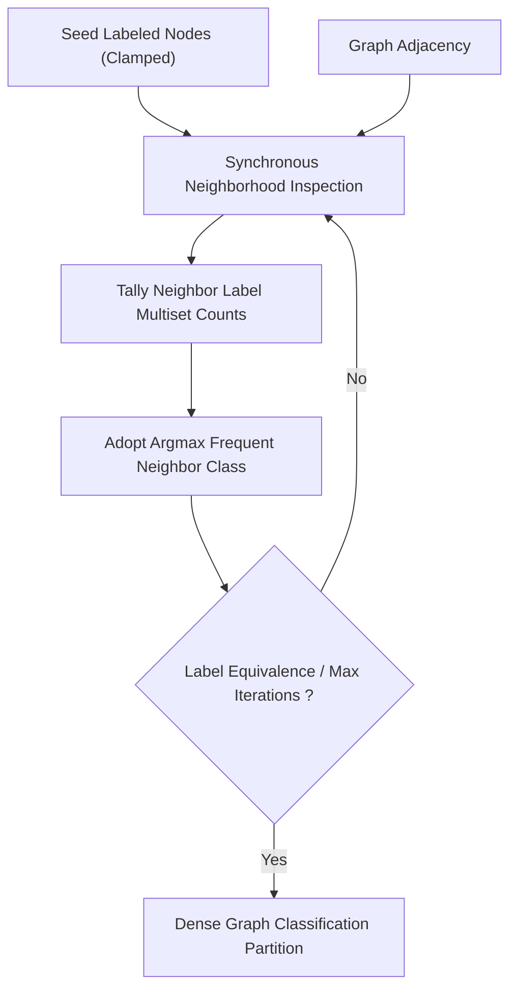

# genpark-label-propagation-semi-supervised-graph-skill

Agent Skill implementing the **Semi-Supervised Label Propagation Algorithm (LPA)** propagating sparse seed node annotations across complex graph topologies.

## Architectural Overview

